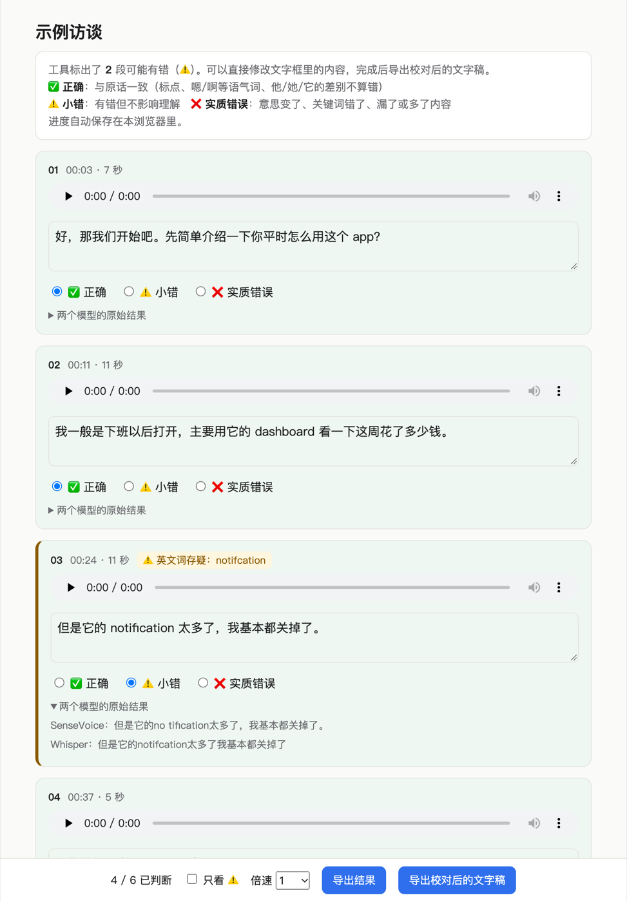

# zh-en-scribe：中英混说录音本地转写与核对工具

**zh-en-scribe 是一个在本地运行的中英混说（中英夹杂）录音转写工具，专为研究访谈设计。** 它同时用 Whisper 和 SenseVoice 两个语音识别模型转写，通过比较两个模型的分歧，自动标出可能识别错误、需要人工回听的片段。分歧处只在两个模型的结果中选择，不用 AI 改写或补全原话。

**zh-en-scribe is an offline transcription tool for Mandarin-English code-switching audio, built for research interviews.** It runs two speech recognition models — Whisper and SenseVoice — and uses their disagreements to flag segments that likely contain errors, so researchers re-listen to only those parts instead of the whole recording. It never rewrites what was said.

- **适合**：中英夹杂的用户访谈、HCI / UX 研究、语码转换（code-switching）研究、双语会议记录
- **本地运行**：录音不上传云端，适合受伦理审查（IRB）约束的研究数据
- **不改写原话**：分歧处只做选择，不用 LLM 润色、补全或翻译
- **初步结果**：一段 13 分钟访谈经人工盲审，合并后的文字稿 44 段中没有实质错误、2 段小错；⚠️ 标记目前偏保守，仍在改进（样本量小，见[评估](#4-评估)）

> 状态：早期原型 v0.1。目前只支持 Apple Silicon Mac。

---

## 快速开始

### 环境要求

| 项目 | 要求 |
|---|---|
| 电脑 | Apple Silicon Mac（M1 及以后）。暂不支持 Intel Mac、Windows、Linux |
| 内存 | 运行时峰值约 4GB。关掉不用的应用可以明显加快速度 |
| 硬盘 | 约 4GB：Python 环境约 1.3GB，模型约 2.5GB |
| 网络 | 只有第一次运行需要，用来下载模型；之后完全离线 |
| 软件 | [Homebrew](https://brew.sh)、[uv](https://docs.astral.sh/uv/)、ffmpeg |

### 1. 安装

```bash
brew install ffmpeg uv                                       # 已经装过可以跳过
git clone https://github.com/neutral-milk-studio/zh-en-scribe.git
cd zh-en-scribe
uv sync                                                      # 按 uv.lock 安装完全相同版本的依赖
```

### 2. 用示例录音试跑（约 2 分钟）

不需要准备自己的录音。下面的脚本用 macOS 自带的语音合成，生成一段 27 秒的虚构中英混说录音：

```bash
sh examples/make_sample.sh                 # 生成 examples/sample.m4a
uv run transcribe.py examples/sample.m4a   # 第一次运行会先下载模型（约 2.5GB）
cat examples/sample.transcript.md
```

正常情况下，文字稿的最后一行应该类似：

```
[00:00] 好，那我们开始吧，你平时怎么用这个app，我一般是下班以后打开，主要看一下dashboard上这周花了多少钱。
但是它的notification太多了，我基本都关掉了。那你觉得哪个feature最有用，应该是budget那个吧，……这个挺make sense的。
```

语音合成的发音很标准，所以这段示例通常不会出现 ⚠️。真实访谈的口音、语速和录音条件都更复杂。

### 3. 转写你自己的录音

```bash
uv run transcribe.py 访谈.m4a              # 支持 m4a / mp3 / wav 等 ffmpeg 能读的格式
uv run transcribe.py a.m4a b.m4a c.m4a     # 一次处理多个文件
```

处理时间大约是录音时长的一半左右，视电脑性能而定。输出文件和录音放在同一个目录：

| 文件 | 内容 |
|---|---|
| `访谈.transcript.md` | 合并后的文字稿，⚠️ 标出需要回听的段 |
| `访谈.compare.md` | 逐段对照：两个模型的原始结果、每处分歧选了哪一边、标记原因 |
| `访谈.asr.json` | 识别结果缓存。调整参数后重跑只需几秒，不用重新识别 |
| `访谈.segments.json` | 逐段结果（文字、是否 ⚠️、时间），供核对网页使用 |

### 用在你自己的项目里

每个研究项目都有自己的术语。仓库里的 `vocab.txt` 和 `corrections.tsv` 是**空模板**，复制一份放进你的项目，改好后用参数指定：

```bash
# --vocab 术语表 / --corrections 纠错表 / --context（可选）从访谈提纲等文档自动提取英文术语
uv run transcribe.py 访谈.m4a \
  --vocab my_project/vocab.txt \
  --corrections my_project/corrections.tsv \
  --context my_project/interview_guide/
```

- **术语表**会作为提示交给 Whisper，让它优先识别成这些写法，同时也用于判断英文词是否存疑。
- **纠错表**用来处理模型反复认错的词：看到 `compare.md` 里同一个错误反复出现，就加一行。
- **`--context`** 适合有访谈提纲的情况，提纲里的问题通常会被访谈者照着念出来。

所有参数：`uv run transcribe.py --help`

### 核对网页：边听边校对

转写完成后，用 `review.py` 生成一个本地网页：每段一个播放按钮，对照文字稿逐段判断对错，可以直接修改文字，最后导出校对好的文字稿。



```bash
uv run review.py 访谈.m4a        # 生成并打开核对网页
```

- **只看 ⚠️**：勾选后只显示工具标记的段，展开"两个模型的原始结果"可以看到两边各识别成了什么
- **倍速播放**：1–2 倍速；一段播完自动滚到下一段
- **自动保存**：进度保存在浏览器里，关掉再打开可以接着做
- **导出**：「导出校对后的文字稿」得到修改后的 Markdown，「导出结果」得到每段的判断（JSON）
- **隐私**：网页和切好的音频片段都在本地 `访谈.review/` 目录，用浏览器直接打开，不上传任何内容

#### 评估工具在你的录音上准不准（盲审）

如果要在论文或报告里说明转写质量，可以用盲审模式：网页**不显示**哪些段被标了 ⚠️，避免评审者受到影响。

```bash
uv run review.py 访谈.m4a --blind                              # 1. 盲审：逐段判断 正确 / 小错 / 实质错误
uv run review.py 访谈.m4a --score ~/Downloads/review_results.json   # 2. 计算漏标率和标记准确率
```

`--score` 会输出：标了 ⚠️ 和没标 ⚠️ 的段各有多少错误、漏标率（有错但没被标出的比例）、标记准确率（标了 ⚠️ 的段里真的有错的比例）。建议请**没参加访谈的人**来做盲审，熟悉内容的人容易"听到自己预期的话"。

### 常见问题排查

| 现象 | 原因和解决办法 |
|---|---|
| `目前只支持 Apple Silicon Mac` | Whisper 部分使用的 mlx-whisper 只能在 M 系列芯片的 Mac 上运行 |
| `找不到 ffmpeg` | 运行 `brew install ffmpeg` |
| 第一次运行时卡在下载、很久没有进度 | 模型从 Hugging Face（Whisper）和 ModelScope（SenseVoice）下载。网络不稳定时下载可能中断但不报错，按 Ctrl+C 停止后重新运行即可 |
| `model 'fsmn-vad' is not registered` | 第一次下载模型时网络断了。联网后重新运行即可；模型下载完成后不会再出现 |
| 运行非常慢、电脑卡顿 | 内存不足，系统在频繁使用硬盘交换数据。关掉不用的应用后重新运行 |
| 启动时输出大量 `funasr ... ModuleNotFoundError` | FunASR 加载可选模块时的提示，不影响运行，可以忽略 |
| 改了术语表或参数，想重新识别 | 加 `--redo-asr`。默认会复用 `.asr.json` 缓存，只重新做对比和合并 |

---

## 1. 问题

访谈双语受访者时，中英混说非常普遍，例如（虚构示例）：

> "我一般会先写一个 prompt，但用久了它的 persona 就会跑偏。"

这类录音转写有三个难点：

**1. 单个识别模型总有一种语言很弱。** 在中英混说对话数据集 CS-Dialogue 上，Whisper 的错误率明显高于专门的中文模型 Paraformer 和 SenseVoice [1]。我们实际录音中的例子：

| 原话 | Whisper large-v3-turbo | SenseVoice-Small |
|---|---|---|
| 跑偏 | 泡片 ❌ | 跑偏 ✅ |
| prompt | prompt ✅ | prot ❌ |
| make sense | make sense ✅ | 没 sense ❌ |
| ChatGPT | XVT ❌ | chBT ❌ |

**2. 转写完不知道哪里错了，只能整段重听核对。** 常见的转写工具只输出一份文字稿，不提示哪里可能识别错了。

**3. 研究访谈不能上传云端，也不能被 AI 改写。** 研究伦理通常要求录音不出本地；质性研究引用的是受访者原话，转写不能被"润色"。

## 2. 核心假设

> **两个训练数据和架构不同的模型，在同一处同时出错、而且错成同一个结果的概率很低。所以两个模型结果不一致的地方，就是最可能有错的地方。**

据此，一致的部分直接采用，只把分歧大的部分交给人工回听。

## 3. 方法

```
录音 → ① 音量标准化 + VAD 切分 → ② Whisper / SenseVoice 分别识别
     → ③ 逐处对比、只做选择 → ④ 标出需回听的段 → 文字稿 + 对照表
```

1. **切分**：ffmpeg `loudnorm` 标准化音量，FSMN-VAD 去掉静音，合并成不超过 20 秒的段。静音和低音量是 Whisper 产生幻觉（输出"请不吝点赞订阅"、日文、俄文等）的主要来源。
2. **双模型识别**：Whisper large-v3-turbo（每段都带上术语表作为提示）和 SenseVoice-Small。
3. **对比合并**：以 SenseVoice 的结果为底稿（它带标点），找出与 Whisper 的实质分歧，忽略标点、语气词和大小写的差异。**每处分歧只在两个候选中选一个**：涉及英文的取 Whisper，纯中文的取 SenseVoice。
4. **标记 ⚠️**，满足任一条件就标：
   - 两个模型的一致度 < 80%
   - 选出的英文词在系统词典和术语表里都查不到
   - 两个结果差异过大（一致度 < 50%），这种段不自动合并

   Whisper 输出了非中英文的字符时，可以判定为幻觉，直接采用 SenseVoice 的结果，不标 ⚠️。

## 4. 评估

> 评估使用的访谈录音涉及受访者隐私，不公开。但评估流程完全可以在你自己的录音上复现：先 `transcribe.py`，再用 `review.py --blind` 盲审、`review.py --score` 计算指标（见[核对网页](#核对网页边听边校对)）。


### 4.1 需要回听的比例

| 录音 | 时长 | 段数 | 标 ⚠️ | 需回听时长 | 占比 |
|---|---|---|---|---|---|
| 访谈 A | 18:35 | 79 | 20 | 02:18 | **12%** |
| 访谈 B | 12:53 | 44 | 7 | 01:56 | **15%** |

### 4.2 人工盲审结果（访谈 B）

需要回听的比例本身没有意义，关键是：**没标 ⚠️ 的段里还剩多少错误？** 我们用 `review.py --blind` 对访谈 B 做了盲审：评审者逐段听录音、判断合并后的文字稿是否正确，评审时不知道哪些段被标了 ⚠️。

| | 段数 | ✅ 正确 | ⚠️ 小错 | ❌ 实质错误 |
|---|---|---|---|---|
| 标了 ⚠️ | 7 | 7 | 0 | 0 |
| 没标 | 37 | 35 | 2 | 0 |
| **合计** | **44** | **42** | **2** | **0** |

**发现：**

1. **合并后的文字稿质量较高**：44 段中没有实质错误，42 段完全正确。
2. **⚠️ 标记在这段录音上偏保守**：标了的 7 段全被判为正确（误报），两处小错都没被标出。
3. **两处漏标的原因**：
   - 两个模型犯了**同样的错**（都把 "prompt" 识别成 "prom"），这正是核心假设失效的情况（见[局限](#5-局限)）
   - 一句音量很低的英文，两个模型的结果一致但有小错
4. **因此，目前不能说"只听 ⚠️ 段就够了"。** 更准确的定位是：⚠️ 段是**优先**回听的地方，而不是**唯一**需要回听的地方。

**方法局限**：只有 1 名评审者，而且就是这次访谈的访谈者，熟悉内容，可能会"听到预期的话"，判断偏宽松。事后复查文字时发现，有几段被判为正确的内容和其中一个模型的结果不一致，可能存在评审偏差。下一步需要请未参加访谈的评审者重复盲审，并计算评审者之间的一致性。

### 4.3 设计决策：为什么不用 LLM 自动修正

我们测试了用本地 LLM（qwen3:4b，通过 Ollama 运行）修正分歧段，结果否定了这个方向。

**做法一：让 LLM 改写整句。** 23 个分歧段中，大约只有 4 段改对了，同时出现了几类研究转写不能接受的错误：

| 错误类型 | 表现 |
|---|---|
| 复制相邻段 | 一段 2 秒的录音，修正结果却是上一段的整句原文 |
| 凭空编造 | 两个模型都只识别出语气词，LLM 却写出了一整句英文 |
| 翻译原话 | 受访者说的中文，被改写成了英文 |
| 丢弃正确候选 | 一个模型的结果明显正确，LLM 却保留了另一个模型的乱码 |

**做法二：只让 LLM 在两个候选中选一个。** 不再编造内容，但在两种方法选得不一样的约 30 处里，简单规则（英文取 Whisper、中文取 SenseVoice）大约 15 处更好，LLM 大约 5 处更好。LLM 常选拼错的英文。

**结论**：在这个任务上，4B 级别的本地 LLM 不如一条简单规则，所以默认不启用（`--llm` 保留为实验选项）。更根本的原因是：对研究转写来说，**通顺但不是原话的文字，比明显的乱码更危险**，因为乱码会提醒人去核对，而通顺的错句会被直接引用。

> 注：上面的好坏判断是对照上下文做出的，没有逐句回听录音，属于粗略评估。

## 5. 局限

- **评估规模小**：目前只有 2 段访谈，共约 31 分钟，来自同一个研究项目；人工盲审只做了 1 段，评审者只有 1 人。结论不一定能推广到其他口音、领域和录音条件。
- **⚠️ 标记的准确率还不够**：在盲审中误报多、对两个模型的共同错误无能为力，阈值和规则还需要更多数据来调整。
- **核心假设会失效**：两个模型可能错成同一个结果，最常见的是冷门专有名词。这类错误不会被标出。
- **不区分说话人**。
- **只支持 Apple Silicon Mac**（Whisper 部分使用 mlx-whisper）。
- **英文词检查依赖 macOS 自带的英文词典**（`/usr/share/dict/words`），新词和专有名词可能被误标，可以把它们加进术语表。

## 常见问题 FAQ

**中英文混合的录音用什么工具转写比较准？**
单个模型通常只擅长一种语言：Whisper 的英文较准，但中文同音字错误多；SenseVoice、Paraformer 的中文较准，但会拼错英文单词。zh-en-scribe 同时使用 Whisper 和 SenseVoice，英文部分采用 Whisper，中文部分采用 SenseVoice，并标出两者分歧大的片段。

**How do I transcribe audio that mixes Chinese and English?**
Single ASR models are usually strong in only one language: Whisper handles English well but makes many Mandarin homophone errors, while SenseVoice handles Mandarin well but misspells English words. zh-en-scribe combines both — English from Whisper, Mandarin from SenseVoice — and flags segments where they disagree for manual review.

**和飞书妙记、讯飞听见这类转写服务有什么区别？**
zh-en-scribe 完全在本地运行、免费，并且会标出可能有错的片段。缺点是目前只支持 Apple Silicon Mac，也不区分说话人。

**Is it private? Does it upload my recordings?**
No. Everything runs locally. The only network access is downloading model weights on first run; after that it works offline.

**可以用 ChatGPT 或其他 LLM 自动修正转写吗？**
我们测试过本地小模型，它会复制别的段落、编造内容，或者把中文原话翻成英文，所以 zh-en-scribe 默认不用 LLM 改写，详见 [4.3](#43-设计决策为什么不用-llm-自动修正)。

**为什么只支持 Mac？**
Whisper 部分目前使用 Apple Silicon 专用的 mlx-whisper。后续计划加入 faster-whisper，以支持 Windows 和 Linux。

## 开发

```bash
uv run pytest        # 对比与合并逻辑的测试，不需要下载模型，几秒内完成
```

修改合并规则或 ⚠️ 标记规则后，请先跑一遍测试。

## 致谢与许可

- 本仓库代码：[MIT](LICENSE)
- [Whisper](https://github.com/openai/whisper)（MIT），通过 [mlx-whisper](https://github.com/ml-explore/mlx-examples) 运行
- [SenseVoice](https://github.com/FunAudioLLM/SenseVoice) 和 FSMN-VAD，来自 [FunASR](https://github.com/modelscope/FunASR)（阿里巴巴通义实验室）。模型权重使用 FunASR Model License v1.1，允许商用，但需要注明出处并保留模型名称。本仓库不分发模型权重，它们在首次运行时从 ModelScope 下载。

## 参考文献

[1] CS-Dialogue: A 104-Hour Dataset of Spontaneous Mandarin-English Code-Switching Dialogues for Speech Recognition. arXiv:2502.18913, 2025.
